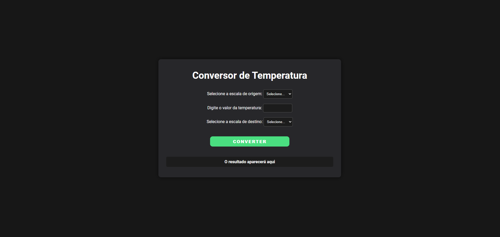

# Conversor de Temperatura

Este projeto consiste em uma aplicação web para conversão de temperaturas entre as escalas Celsius, Fahrenheit e Kelvin. Foi desenvolvido com foco em simplicidade e responsividade, utilizando HTML, CSS e JavaScript para o front-end.

## Funcionalidades

- Escolha da escala de origem (Celsius, Fahrenheit ou Kelvin).
- Inserção do valor da temperatura a ser convertido.
- Escolha da escala de destino (Celsius, Fahrenheit ou Kelvin).
- Validação dinâmica para evitar seleção de mesma escala como origem e destino.
- Envio de dados a um endpoint de API para realização da conversão.
- Exibição do resultado na interface.

## Tecnologias Utilizadas

- **HTML**: Estruturação da interface.
- **CSS**: Estilização responsiva e moderna, incluindo mídia queries para diferentes tamanhos de tela.
- **JavaScript**: Manipulação de eventos, integração com API e lógica de validação.

## Como Executar o Projeto

1. Clone este repositório:

   ```bash
   git clone https://github.com/seu-usuario/conversor-de-temperatura.git
   ```

2. Navegue até o diretório do projeto:

   ```bash
   cd conversor-de-temperatura
   ```

3. Abra o arquivo `index.html` em um navegador web.

4. Certifique-se de que o servidor para a API de conversão esteja em execução e configurado para o endpoint `http://192.168.15.21:8080/api/calculadora/converter`.

## Estrutura de Arquivos

```
/
├── index.html      # Estrutura principal da aplicação
├── style.css       # Estilização visual
├── index.js        # Lógica e interação do front-end
```

## Funcionalidade da API

A aplicação faz chamadas a um endpoint REST para realizar a conversão de temperatura. A API deve estar configurada para:

- Receber requisições POST com o seguinte payload:

  ```json
  {
      "option": "cf", // Combinação da escala de origem e destino
      "valor": 25      // Valor da temperatura
  }
  ```

- Retornar uma resposta com o resultado da conversão:

  ```json
  {
      "resultado": 77
  }
  ```


## Capturas de Tela



## Licença

Este projeto é distribuído sob a licença MIT.

